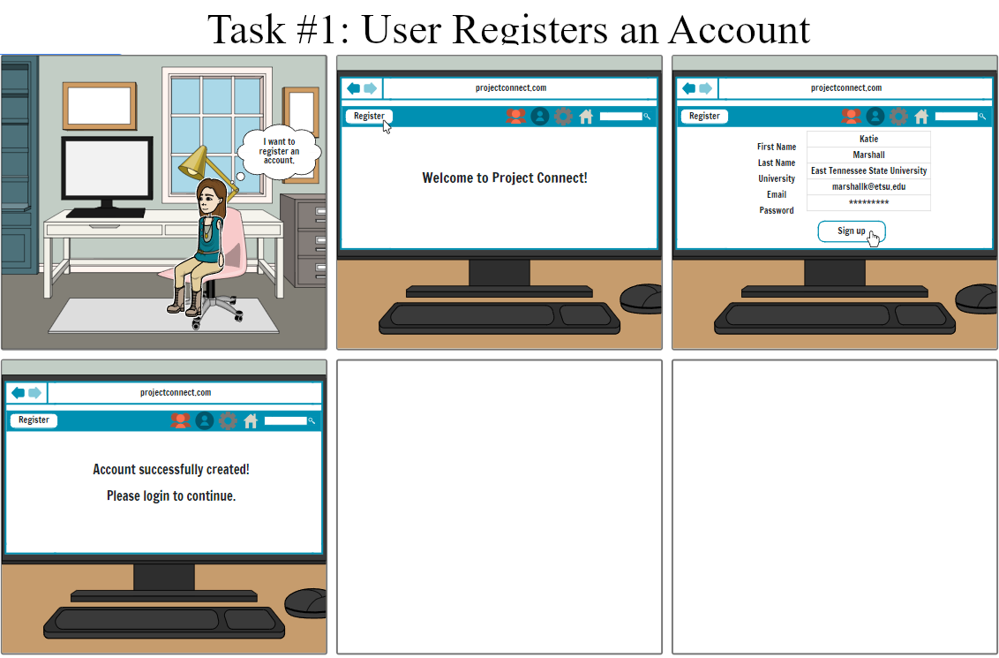
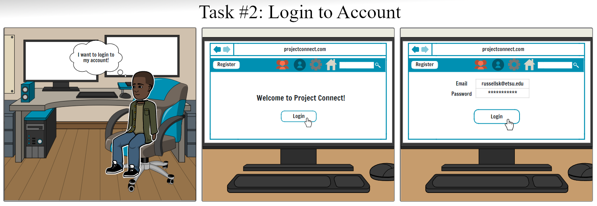
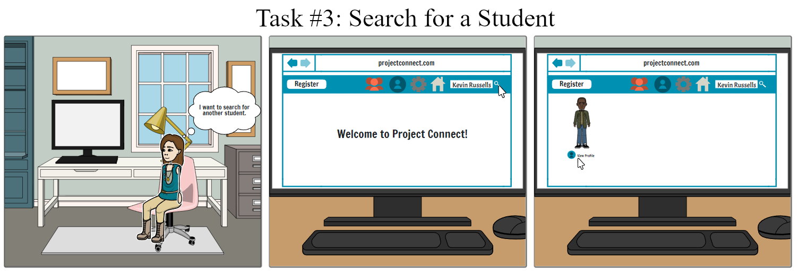
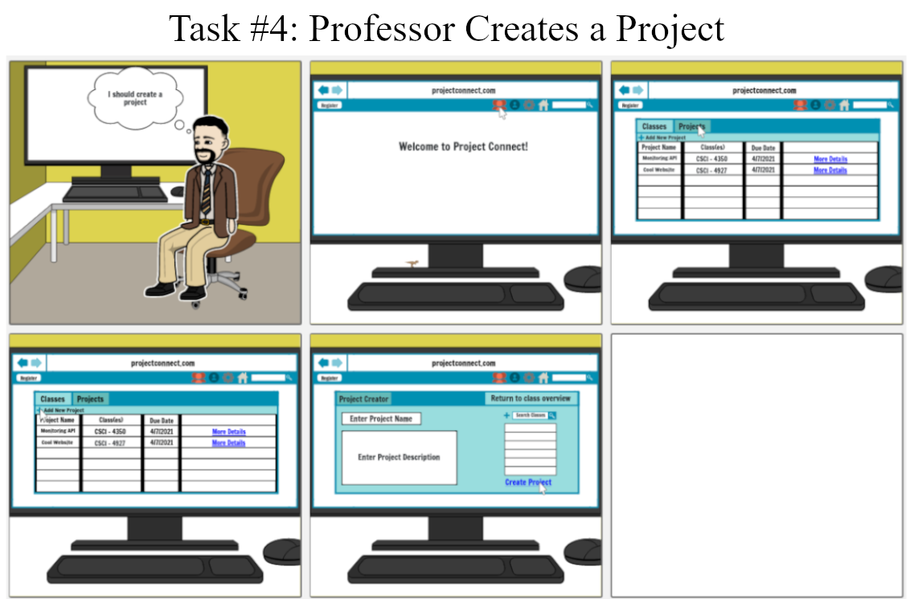
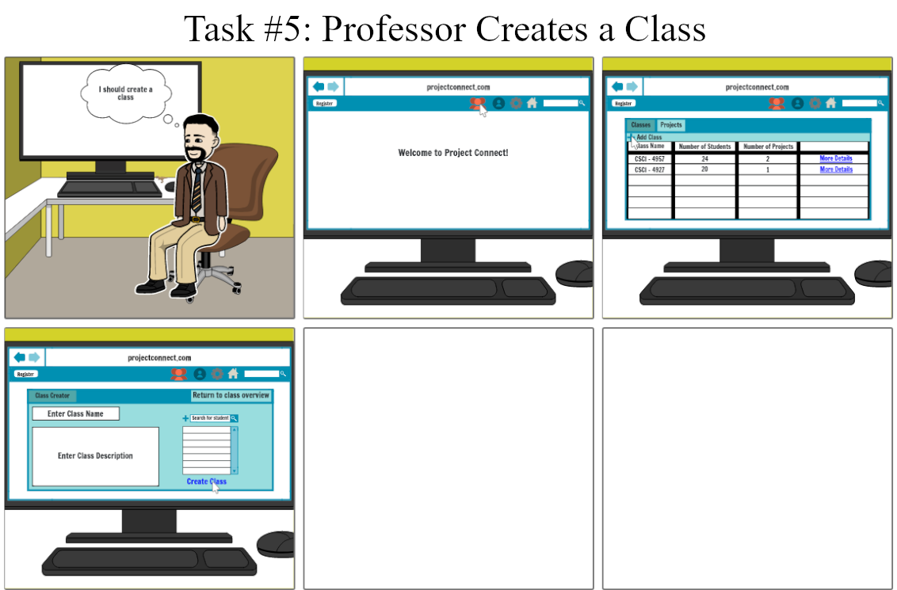
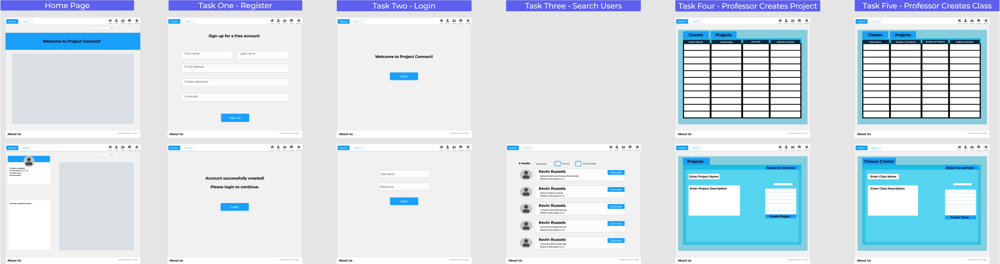

************
deliverable2
************

**HCI Team Groovy Goobers' Deliverable 2 Files.**

Table of Contents
#################

- `Overview`_
- `Storyboards`_
- `Wireframes`_
- `HTML Prototype`_

Overview
#########

For a quick recap our project and problem space, the Groovy Goobers are seeking to create a solution
suitable for university students to rate each other nad view ratings of each other from course team
projects. Additionally, our solution aims at making issuing and tracking peer evaluations easier on
an instructor's end by allowing the professor to issue peer evaluations within the platform per
project. The peer evaluations are intended to cumulatively form each student's rating.

Having previously explicated the problem, offered our solution, generated personas, and roughly
drafted five task flows in Deliverable 1, we have now entered the early stages of design. In this
deliverable we have mapped our task flows onto storyboards, developed wireframes as higher-fidelity
corrolaries of the storyboards, and finally prototyped a clean, fully responsive HTML protoype for
the interface we have names ProjectConnect, that we feel accurately reflects the core visual
components and layout that we will use when we begin developing the functionality of our solution.

This README file is designed so you can conveniently view and all of our Deliverable 2 work
from within this file. In the `HTML Prototype`_  section, you fill find links that will let
you access the protype's web pages from within your browser.

Note on Viewing the Prototype Pages
***********************************

The landing page, registration page, and login page are all accessible from the main navigation,
however, the search page (located in `src/search.html`) cannot be accessed from any of the site
links. This is because the search page represents a primative version of what will become the
new home page following a student's login. The search page does have working search and sorting.

Storyboards
###########

|

|

|

|

Wireframes
##########

HTML Prototype
##############

- `View Prototype <https://htmlpreview.github.io/?https://github.com/HCI-Groovy-Goobers-II/deliverable2/blob/main/src/index.html>`_
- `View Student search page <https://htmlpreview.github.io/?https://github.com/HCI-Groovy-Goobers-II/deliverable2/blob/main/src/search.html>`_